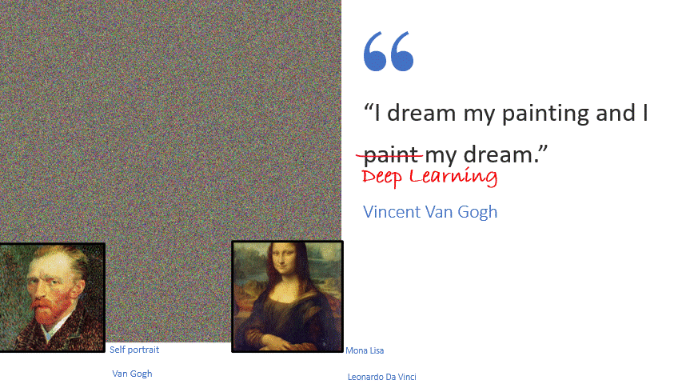
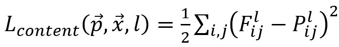
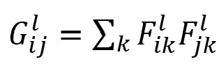
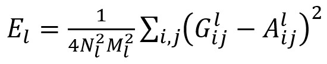
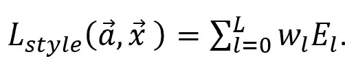
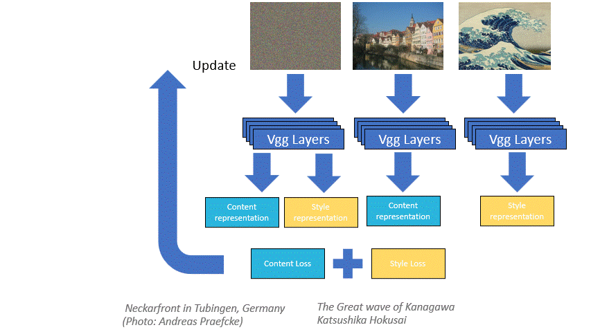
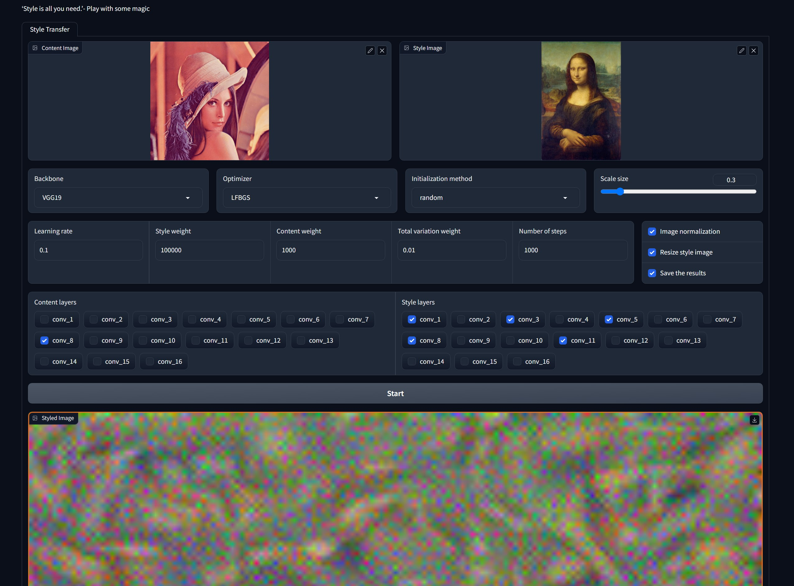

# 💫SIAYN - Style Is All You Need



Based on Image Optimization - this method, of image style transfer, using convolutional neural networks for feature extraction and optimization techniques for blending between content and style images. The algorithm is essentially a texture transfer method that incorporates feature representations from cutting-edge Convolutional Neural Networks (VGG in our case). By utilizing deep image representations for both the texture and style parts, the process elegantly simplifies into an optimization problem within a single neural network. To generate a new image, an image optimization is conducted to align feature representations (of content and style) with those of the example images. This work based on paper "Image Style Transfer Using Convolutional Neural Networks" [2]

## 💡Motivation
Once upon a time, painters and photographers practiced their skills over many years. In our days we have a lot of different photos, images, and drawings. Each one of them uses different styles and techniques, many of them through years of experience.  With all technological development, in our opinion, it’s important to save artistic side of the humanity and continue to develop it. Technology in this case can help people describe them self and create art in unique style or based on style of other, when ease of using tools can increase the quantity and quality of works.
## 📓Theoretical background
Based on Image Optimization - this method, of image style transfer, using convolutional neural networks for feature extraction and optimization techniques for blending between content and style images. To generate new image, an image optimization is conducted to align feature representations (of content and style) with those of the example images.
This algorithm can be described in a few steps:  image preprocessing, feature extraction, content representation distance  (content loss), style representation distance (style loss), optimization based on sum of both content and style losses and postprocessing. 

* The first step, preprocessing, usually in our case its image resizing and normalization. Resizing for content image can be done for image scaling up (super resolution, will be discussed further) or for image scaling down if there is not enough GPU memory. 
* Feature extraction – the content image and style image are passed through the backbone Convolutional Neural Network (CNN) model, layer by layer, to extract features. In our work VGG16 and VGG19 were tested. The features can be extracted from each layer of the model and different layers can be used for computing of content and loss style.
* The next step is content loss calculation. The content loss measures the similarity between the feature representations of the content image and the generated image (that was initialized in one from different techniques). This loss in our case was computed as the mean squared error (MSE) between the feature maps of a chosen layer in the backbone CNN. Based on original paper [2] the content loss calculated in this way,

 when p is original image, x generated, l is layer that was used for feature extraction from backbone CNN, F^l and P^l are features maps representing respectively layer l.
* Style loss calculation quantifies the difference in style between the style image and the generated image.
It is computed by comparing the correlations of feature maps at different layers of the backbone CNN. 
The style loss in our case is calculated as the mean squared error (MSE) between the Gram matrices of the style image and the generated image. 
Gram matrix is features correlation between different filters in CNN layer. The Gram matrix calculating in the following way: 
. The style loss for each layer  and total for all layers that were used: . When a ⃗ is original image and x ⃗ is generated one, l  is the layer that used for style loss. A^l and G^l are gram matrices of style and generated images. L_style is weighted sum of all differences in gram matrices in different layers that were used. 
 
* *Optimization step* – For a new image generation, first its need to be initialized (for example from Gaussian noise). For input images, content and style, we prepare style and content representation as described above. The same content and style representations are prepared for initialized image. Now we will minimize the distance (using gradient decent) between representations of initialized image and the original style and content images. The optimization is based on total loss, weighted sum of content and style loss. This process will give us our desired blended image.
* *Postprocessing* – this step is not mandatory, here we can use techniques like denoising, color grading etc. 




## 📝Features
 
1. ***Code with modules, parametric flexibility*** - Code build with module for easy expansion, additions and changes. Like adding backbone, change loss type etc.
2. ***Different style/content weight*** – the loss for optimization consists of weighted sum of content and style losses that can be tunned. 
3. ***Initialization method*** – Number of different initialization for generated image can be chosen, Gaussian noise, style or content images. 
4. ***Total variation loss*** - option to add TV loss to total loss, designed to encourage smoothness and reduce noise in an image.
5. ***Image normalization*** – Option to perform mean and variance normalization with values calculated from ImageNet dataset.
6. ***Different optimization*** – there option to chose optimizer, 'Adam' or 'LBFGS'. 
7. ***Super resolution*** – option to generate image in bigger resolution than original one. 
8. ***Different content/style layers*** - option to chose layers that will be used for features extracion.
9. ***Resizing style image*** – options to resize style image begore style transfer.
10. ***Different Backbone*** – options to chose VGG16 or VGG19 for backbone model for feature extracion. 
11. ***Style merge*** – Option to merge and transfer a number of styles. 
12. ***Postprocessing*** – A number of methods for improving the result with postprocessing techniques. 
- Noise reduction with help of Non-local means.
- Segmentation and masking - using mask as additional information for style manipulation. The mask can be created with segmentation algorithms or in manual way with special programs. 
- Histogram matching to manipulate color tone of output image.

## 🎯Results
Examples of Lena with different style

|  |  |  |
|-----------------------------------|-----------------------------------|-----------------------------------|
|  |  |  |
## 🧑‍💻Installation

Install my-project with npm

```
  git clone https://github.com/EvgeniyJP/SIAYN.git
  cd SIAYN
  pip install requirements.txt
```
## 🏃Usage/Examples

Start style transfer with specific config file, more about config file can be found below 
```
python style_runner.py --config_file style_transfer_default
```

Start style transfer with default config file, more about default config file can be found below 
```
python style_runner.py
```

Perform postprocessing with specific config file 
```
python postprocess_runner.py --config_file  postprocessing_default
```

Run GUI 
```
python gui_runner.py  
```
## 💻Gui Demo- Gradio Based

This Gui helps to understand basic parameters and their influence. How to run the GUI you can see at Usage/Examples. 
More about parameters you can see in config format explanation.

Currently, the GUI doesn't support multi-style transfer and postprocessing 


## 📁Project Tree
```
💫SIAYN
│   README.md
│   style_runner.py    
│   postprocess_runner.py
|   gui_runner.py
|
└───config
│   │   postprocessing_default.yaml
│   │   style_transfer_default.yaml  
│   
└───core
|   │   Backbone.py
|   │   StyleTransferSolver.py
│   
└───data
|   │   content
|   │   style
│   
└───gui
|   │   gui_core.py
|   
└───result
|   │   example
|   |   test1
|
└───util
|   │   img.py
|   |   logger.py
```

* ``` style_runner.py ``` - File for running all style transfer functions, loading config file (default ``` style_transfer_default.yaml``` from ``` config```) More about config files can be found in section **Config Format**

* ``` postprocess_runner.py ``` - File for running all postprocess runner functions that  were asked for in config file, loading config file (default ``` postprocessing_default.yaml``` from ``` config```)

* ```gui_runner.py``` - Wraper to run gui for basic actions (more can be found in GUI section)

* ```config``` here stored all config files that can be edited or added a new ones.

* ``` core\Backbone.py``` - Here all backbones that can be used for feature extraction (VGG16 and VGG19 in our case), a new one can be added here. 

* ``` core\StyleTransferSolver.py ``` - Here canbe found all fucntions for style transfer, generated image initialization, creating optimizer, loss calculation and optimization it self. 

* ``` data\style``` - All images for style transfer should be here 

* ``` data\content``` - All images for content transfer and masks (if needed) should be here 

* ``` gui\gui_core.py ``` - here function for creation GUI based on gradio

* ``` result``` - folder where the result will be saved. 

* ```util\img.py``` - file with all basic image functions like load image, transform, save... In addition to that, postprocessing function like denosing, mask aplying, gif creation and histogram matching also here. 

* ```util\logger.py``` - Here a class for logs printing/saving in more beautiful and comfortable way. 

## ⚙️Configuration files format

### Configuration example file for running style stransfer
```yaml
test1:
  scaler: 0.5
  init_method: 'random'
  backbone: 'VGG19'
  lr: 1
  opt: 'LFBGS'
  num_steps: 1000
  style_weight: 1e5
  content_weight: 1e3
  tv_weight: 1e-2
  norm: True
  style_layers: ['conv_1', 'conv_3', 'conv_5', 'conv_7', 'conv_11']
  style_layers_weights: null
  style_resize: True
  content_layers: ['conv_8', ]
  style: 'vg_starry_night.jpg'
  content: 'lena_color.gif'
```
| Parameter Name      | Description |
| ----------- | ----------- |
| test1      | Running test name|
| scaler   | Scale factor for generated image up/down scale        |
| init_method   | Initialization method for generated image, options: ['random', 'style','content']        |
| backbone   | Backmodel for feature extraction, options: ['VGG16', 'VGG19']        |
| lr   | Learning rate for otimizer        |
| opt   | Optimizer that will be used, options: ['Adam', 'LFBGS']       |
| num_steps   | Maximum number of steps that will be performed        |
| style_weight   | Style features loss weight in total loss        |
| content_weight   | Content features loss weight in total loss        |
| tv_weight   | Total variation loss weight in total loss, None for disabling        |
| norm   | Flag for performing mean, standard deviation normalization with ImageNet parameters.        |
| style_layers   | Layers of backbone layers that will be used for feature extraction, [conv_i], when i index of layer in list of cnn layer of backbone        |
| style_layers_weights   | Weights list for each feature layer loss, None - regular average between layers       |
| style_resize   | If true, will resize style image to be in the same size as content        |
| content_layers   | Layers of backbone layers that will be used for feature extraction, [conv_i], when i index of layer in list of cnn layer of backbone        |
| style   | image name that will bbe used for style transfer, must be in 'data/style'        |
| content   | image name that will bbe used for content transfer, must be in 'data/content'             |

* This config file support running a number of style transfers, can be added in the same format,
``` 
test1:
    parameters...
test2:
    different parameters ...
```
* For multi stlye transfer, style_weight must be a list of weights for ieach image style, style - must be a list toof file names for style 

### Configuration example file for postprocessing 
```
test1:
  use_denoise: True
  p3: 10
  p4: 10
  p5: 7
  p6: 15
  img_path: 'result/example/frog!-!Edvard_Munch_1893_The_Scream_oil_tempera_and_pastel_on_cardboard_91_x_73_cm_National_Gallery_of_Norway-825x1024-1.png'

  use_mask: True
  mask: 'frog_mask.png'
  content: 'frog.png'
  styled: 'result/example/frog!-!Edvard_Munch_1893_The_Scream_oil_tempera_and_pastel_on_cardboard_91_x_73_cm_National_Gallery_of_Norway-825x1024-1.png'

  use_histogram: True
  source: 'result/example/frog!-!Picasso_The_Weeping_Woman.png'
  target: 'Mona_Lisa_by_Leonardo_da_Vinci_from_C2RMF_retouched-1-687x1024-1.jpg'

  use_mask_creation: True
  p_image: 'frog.png'
  scaler: 0.3

  use_gif_creation: False
  path: 'result/test1'
  out_name: 'transformation'
  fps: 5
  ```

| Parameter Name      | Description |
| ----------- | ----------- |
| test1      | Running test name|
| use_denoise   | If true noise reduction with help of Non-local means will be used, based on cv2|
| p3   | Size in pixels of the template patch that is used to compute weights.        |
| p4   | Size in pixels of the window that is used to compute a weighted average for the given pixel.        |
| p5   | Parameter regulating filter strength for luminance component.        |
| p6   | Same as above but for color components // Not used in a grayscale image.        |
| img_path   | path to image to be denoised        |
| use_mask   | If true, mask will be applied on the image         |
| mask   | mask name, from 'data/content'        |
| content   |  original content name, from 'data/content'         |
| styled   |  path to styled iamge         |
| use_histogram   | If true, histagram matching will be performed        |
| source   | Image path for histogram matching         |
| target   |  Image path for histogram to be matched          |
| use_mask_creation   | If true, will run segmantaion algorithm for masking creation, pretrained segmentation.fcn_resnet101        |
| p_image   | path to image for segmantion, from 'data/content'        |
| scaler   | Scale factor for mask image up/down scale        |
| use_gif_creation   | If true will create gif from output images       |
| path   | path to folder with images for giff creation        |
| out_name   |    Name for output file      |
| fps   | FPS - number of images per second         |

* This config file support running a number of postprocessing, can be added in the same format,
``` 
test1:
    parameters...
test2:
    different parameters ...
```
## 🙋Acknowledgements

References

 - [[1] The Significant Role of Art In Shaping Our Society](https://www.chitkara.edu.in/blogs/the-significant-role-of-art-in-shaping-our-society/#:~:text=What%20is%20the%20impact%20of,exist%20in%20a%20particular%20time)
 - [[2] Image Style Transfer Using Convolutional Neural Networks](https://www.cv-foundation.org/openaccess/content_cvpr_2016/papers/Gatys_Image_Style_Transfer_CVPR_2016_paper.pdf)
 - [[3] CNN VGG 16 and VGG 19 architecture illustration](https://datahacker.rs/deep-learning-vgg-16-vs-vgg-19/)

Useful code 
- [1. Neural Style Transfer (optimization method)](https://github.com/gordicaleksa/pytorch-neural-style-transfer)
- [2. NEURAL TRANSFER USING PYTORCH](https://pytorch.org/tutorials/advanced/neural_style_tutorial.html)
- [3. Neural Transfer](https://github.com/titu1994/Neural-Style-Transfer/blob/master/color_transfer.py)
- [4. style-transfer-pytorch](https://github.com/psh01087/style-transfer-pytorch)

Used images
* (1) - Neckarfront in Tubingen, Germany (Photo: Andreas Praefcke)
* (2) - The Great wave of Kanagawa, Katsushika Hokusai
* (3) - The Starry Night by Vincent van Gogh, 1889
* (4) - Image of Lena Forsén used in many image processing experiments
* (5) – The Weeping Woman, Picasso
* (6) – The Scream, Edvard Munch 
* (7) – Mona Lisa, Leonardo da Vinci
* (8) – Girl with a Pearl Earring, Johannes Vermeer
* (9) – The frog, Evgeniy Pukhov

